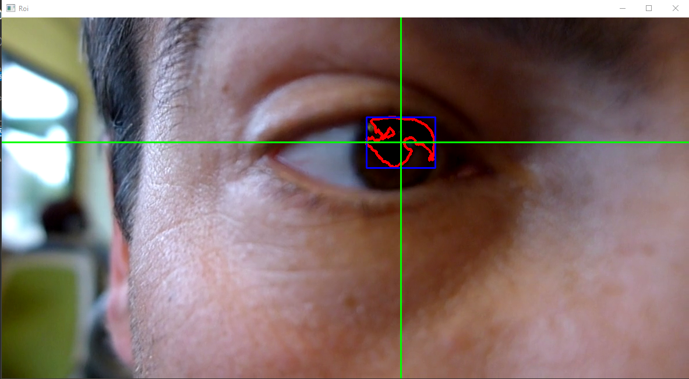

# Gaze Tracking With OpenCV Using Python

---

Eye tracking is a widely used tool for behavioral research in the field of psychology. With technological advancement, we now have specialized eye-tracking devices that offer high sampling rates, up to 2000 Hz, and allow for measuring eye movements with high accuracy. They also offer high spatial resolution, which enables the recording of very small movements

### Technologies used :

---

###### 1 - Python.

###### 2 - OpenCV :

- (Open Source [Computer Vision](https://en.wikipedia.org/wiki/Computer_vision) Library) is a library of programming functions mainly aimed at real-time [Computer Vision](https://en.wikipedia.org/wiki/Computer_vision). Originally developed by [Intel](https://en.wikipedia.org/wiki/Intel), it was later supported by [Willow Garage](https://en.wikipedia.org/wiki/Willow_Garage) then Itseez (which was later acquired by [Intel](https://en.wikipedia.org/wiki/Intel)). The library is cross-platform and free for use under the open-source Apache 2 License. Starting with 2011, OpenCV features GPU acceleration for real-time operations.

### How To Use This Code :

---

###### First Install The Requirements :

- `pip install opencv-python`

###### Change The Input Video :

- `cap = cv2.VideoCapture("eye_recording.mp4")`

###### Run Python File :

- `python main.py`

### Output Video

---
Output 1 :

---
Output 2 :

---